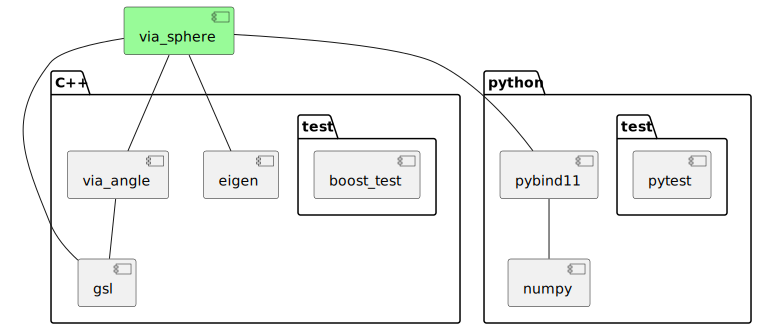

# via-sphere-cpp

[](https://opensource.org/license/mit/)
[](https://github.com/kenba/via-sphere-cpp/actions)
[](https://codecov.io/gh/kenba/via-sphere-cpp)

A library for performing geometric calculations on the surface of a sphere.

The library uses a combination of spherical trigonometry and vector geometry
to perform [great-circle navigation](https://en.wikipedia.org/wiki/Great-circle_navigation)
on the surface of a unit sphere, see *Figure 1*.


*Figure 1 A Great Circle Arc*

A [great circle](https://en.wikipedia.org/wiki/Great_circle) is the
shortest path between positions on the surface of a sphere.
It is the spherical equivalent of a straight line in planar geometry.

## Spherical trigonometry

A great circle path between positions may be calculated using
[spherical trigonometry](https://en.wikipedia.org/wiki/Spherical_trigonometry).

The [course](https://en.wikipedia.org/wiki/Great-circle_navigation#Course)
(initial azimuth) of a great circle can be calculated from the
latitudes and longitudes of the start and end points.
While great circle distance can also be calculated from the latitudes and
longitudes of the start and end points using the
[haversine formula](https://en.wikipedia.org/wiki/Haversine_formula).
The resulting distance in `Radians` can be converted to the required units by multiplying the distance by the Earth radius measured in the required units.

## Vector geometry

Points on the surface of a sphere and great circle poles may be represented
by 3D [vectors](https://www.movable-type.co.uk/scripts/latlong-vectors.html).
Many calculations are simpler using vectors than spherical trigonometry.


*Figure 2 Spherical Vector Coordinates*

For example, the across track distance of a point from a great circle can
be calculated from the [dot product](https://en.wikipedia.org/wiki/Dot_product)
of the point and the great circle pole vectors.
While the intersection points of great circles can simply be calculated from
the [cross product](https://en.wikipedia.org/wiki/Cross_product) of their
pole vectors.

## Design

The `great_circle` module performs spherical trigonometric calculations
and the `vector` module performs vector geometry calculations.
See: [spherical vector geometry](https://via-technology.aero/navigation/spherical-vector-geometry/).

The software uses types: `Angle`, `Degrees` and `Radians` from the
[via-angle-cpp](https://github.com/kenba/via-angle-cpp) library.


*Figure 3 Class Diagram*

The `Vector3` class is an alias for the [Eigen](https://eigen.tuxfamily.org/) `Vector3` class.

## Example

The following example calculates the intersection between two Great Circle `Arc`s.
The values are taken from Charles Karney's original solution to
[Intersection between two geodesic lines](https://sourceforge.net/p/geographiclib/discussion/1026621/thread/21aaff9f/#fe0a).

### C++
```C++
#include "via/sphere.hpp"
#include <boost/test/unit_test.hpp>

using namespace via;

BOOST_AUTO_TEST_CASE(test_arc_intersection_point) {
  const LatLong<double> istanbul(Degrees(42.0), Degrees(29.0));
  const LatLong<double> washington(Degrees(39.0), Degrees(-77.0));
  const LatLong<double> reyjavik(Degrees(64.0), Degrees(-22.0));
  const LatLong<double> accra(Degrees(6.0), Degrees(0.0));

  const Arc<double> arc1(istanbul, washington);
  const Arc<double> arc2(reyjavik, accra);

  const auto intersection_point_1{calculate_intersection_point(arc1, arc2)};
  BOOST_CHECK(intersection_point_1.has_value());

  const LatLong<double> latlong_1{intersection_point_1.value()};
  // Geodesic intersection latitude is 54.7170296089477
  BOOST_CHECK_CLOSE(54.72, latlong_1.lat().v(), 100 * 0.05);
  // Geodesic intersection longitude is -14.56385574430775
  BOOST_CHECK_CLOSE(-14.56, latlong_1.lon().v(), 100 * 0.02);
}
```

### Python
```Python
import pytest
from numpy.testing import assert_almost_equal
from via_angle import Degrees
from via_sphere import Arc, LatLong, calculate_intersection_point

def test_arc_intersection_point():
    istanbul = LatLong(Degrees(42.0), Degrees(29.0))
    washington = LatLong(Degrees(39.0), Degrees(-77.0))
    reyjavik = LatLong(Degrees(64.0), Degrees(-22.0))
    accra = LatLong(Degrees(6.0), Degrees(0.0))

    arc1 = Arc(istanbul, washington)
    arc2 = Arc(reyjavik, accra)

    intersection_point_1 = calculate_intersection_point(arc1, arc2)
    latlong_1 = LatLong(intersection_point_1)
    assert_almost_equal(54.72, latlong_1.lat().v(), 0.05)
    assert_almost_equal(-14.56, latlong_1.lon().v(), 0.02)
```

## Use

The C++ software depends on:

* the [via-angle-cpp](https://github.com/kenba/via-angle-cpp) library;
* the [Eigen](https://gitlab.com/libeigen/eigen) linear algebra library;
* and the Microsoft [GSL](https://github.com/microsoft/GSL) library to provide [Contracts](https://isocpp.org/files/papers/P2900R6.pdf) support.

The C++ tests use the [boost.test](https://www.boost.org/doc/libs/1_86_0/libs/test/doc/html/boost_test/intro.html)
library, see *Figure 4*.


*Figure 4 Sphere Dependencies*

### C++

#### Installation

The library is header only, so the library `include` directory just needs to be added to the include path.
Alternatively, when using [cmake](https://cmake.org/) the environment variable `ViaSphere_DIR` just needs
to be set to the location of the `via-sphere-cpp` directory; `cmake` will add it to the include path.

Note: `CMakeLists.txt` is setup to install python by default, so `-DINSTALL_PYTHON=OFF`
must be passed to `cmake` when building for C++.

`cmake` can also be used to install the library to the relevant include directory on Linux/macOS.
In the `via-sphere-cpp` directory, run:

```bash
cmake -DINSTALL_PYTHON=OFF .
sudo make install
```

Note: it will be necessary to delete the `CMakeCache.txt` file created by
running `cmake` above, before running `cmake` on this library again.

#### Tests

The C++ tests can be built and run using `cmake` by running:

```bash
cmake -DCMAKE_EXPORT_COMPILE_COMMANDS=1 -DINSTALL_PYTHON=OFF -DCPP_UNIT_TESTS=ON <via-sphere-cpp directory>
make
make test
```

Note: `-DCMAKE_EXPORT_COMPILE_COMMANDS=1` creates a `compile_commands.json`
file which can be copied back into the `via-sphere-cpp` directory for
[clangd](https://clangd.llvm.org/) tools.

### Python

The library uses [pybind11](https://github.com/pybind/pybind11) to provide C++ Python bindings
and [scikit-build](https://pypi.org/project/scikit-build/) to build a python package using
[cmake](https://cmake.org/).

From the parent directory of `via-sphere-cpp`:

```bash
pip install ./via-sphere-cpp
```

In Python code import the software as `via_sphere`, e.g.:

```python
from via_sphere import Angle, Degrees, Radians
```

See: [test_Arc.py](python/tests/test_Arc.py).

## License

`via-sphere-cpp` is provided under a MIT license, see [LICENSE](LICENSE).
